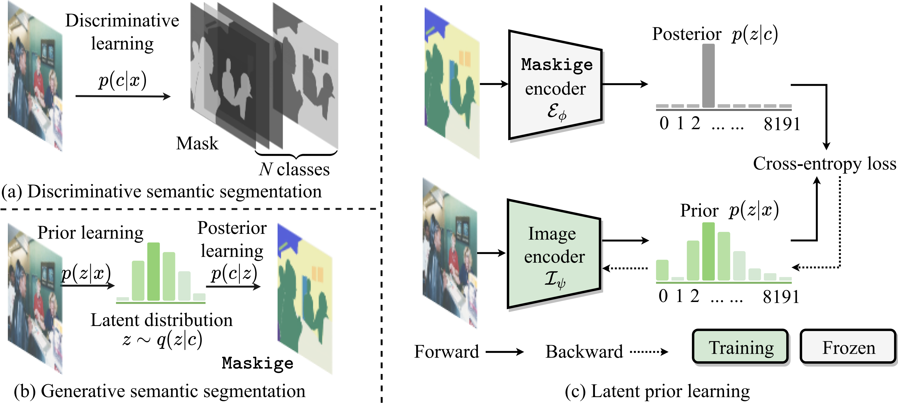

#  _Generative Semantic Segmentation_
### [Paper](https://arxiv.org/abs/2303.11316)
> [**Generative Semantic Segmentation**](https://arxiv.org/abs/2208.11112),            
> [Jiaqi Chen](https://scholar.google.com/citations?user=Au_y5poAAAAJ), [Jiachen Lu](), [Xiatian Zhu](https://xiatian-zhu.github.io), and [Li Zhang](https://lzrobots.github.io) \
> **CVPR 2023**
## Abstract

<!-- [ABSTRACT] -->
We present _**Generative Semantic Segmentation**_ (GSS),
a generative framework for semantic segmentation.
Unlike previous methods addressing a per-pixel classification problem,
we cast semantic segmentation into an _**image-conditioned 
mask generation problem**_.
This is achieved by replacing the conventional per-pixel discriminative learning with a latent prior learning process.
Specifically, we model the variational posterior distribution of latent variables given the segmentation mask.
This is done by expressing the segmentation mask with a special type of image (dubbed as _maskige_).
This posterior distribution allows to generate segmentation masks unconditionally.
To implement semantic segmentation, we further introduce a conditioning network (_e.g._, an encoder-decoder Transformer)
optimized by minimizing the divergence between the posterior distribution of maskige (_i.e._ segmentation masks) and the latent prior distribution of input images on the training set.
Extensive experiments on standard benchmarks show that our GSS can perform competitively to prior art alternatives in the standard semantic segmentation setting,
whilst achieving a new state of the art in the more challenging cross-domain setting.
<!-- [IMAGE] -->


## TODO List

- [ ] Upload model weights and DALL-E VQVAE weight
- [ ] Provide stage-1 training code and Maskige reconstruction code
- [ ] Provide the illustration of the GSS-FF and GSS-FT-W (and more training details)
- [ ] Complete install.md
- [ ] Add dataset link

## Results
<!-- [RESULTS] -->
### Cityscapes

<table><tbody>
<!-- START TABLE -->
<!-- TABLE HEADER -->
<th valign="bottom">Name</th>
<th valign="bottom">Backbone</th>
<th valign="bottom">Iterations</th>
<th valign="bottom">mIoU</th>
<th valign="bottom">mAcc</th>
<th valign="bottom">Config</th>
<th valign="bottom">checkpoint</th>

 <tr><td align="left">GSS-FF</td>
<td align="center">R101</td>
<td align="center">80k</td>
<td align="center">77.76</td>
<td align="center">85.9</td>
<td align="center"><a href="configs/gss/cityscapes/gss-ff_r101_768x768_80k_cityscapes.py">config</a></td>
<td align="center"><a href="https://drive.google.com/drive/folders/1riNfPpzc_6XaCzcNuzqZaRYakO_8aItG?usp=sharing">google drive</a></td>
</tr>

 <tr><td align="left">GSS-FF</td>
<td align="center">Swin-L</td>
<td align="center">80k</td>
<td align="center">78.90</td>
<td align="center">87.03</td>
<td align="center"><a href="configs/gss/cityscapes/gss-ff_swin-l_768x768_80k_cityscapes.py">config</a></td>
<td align="center"><a href="https://drive.google.com/drive/folders/1BTvchDJtUk4rRJ0qK2rcApbHEAEK1bEZ?usp=sharing">google drive</a></td>
</tr>

 <tr><td align="left">GSS-FT-W</td>
<td align="center">ResNet</td>
<td align="center">80k</td>
<td align="center">78.46</td>
<td align="center">85.92</td>
<td align="center"><a href="configs/gss/cityscapes/gss-ft-w_r101_768x768_80k_40k_cityscapes.py">config</a></td>
<td align="center"><a href="https://drive.google.com/drive/folders/1HDeewsE6E9oLZ9ROCH7KgAHaAZeSUj95?usp=sharing">google drive</a></td>
</tr>

 <tr><td align="left">GSS-FT-W</td>
<td align="center">Swin-L</td>
<td align="center">80k</td>
<td align="center">80.05</td>
<td align="center">87.32</td>
<td align="center"><a href="configs/gss/cityscapes/gss-ft-w_swin-l_768x768_80k_40k_cityscapes.py">config</a></td>
<td align="center"><a href="https://drive.google.com/drive/folders/1Rin_JkIsgAtjXgI5ruKW-gmC6fpawTrx?usp=share_link">google drive</a></td>
</tr>

</tbody></table>

### ADE20K

<table><tbody>
<!-- START TABLE -->
<!-- TABLE HEADER -->
<th valign="bottom">Name</th>
<th valign="bottom">Backbone</th>
<th valign="bottom">Iterations</th>
<th valign="bottom">mIoU</th>
<th valign="bottom">mAcc</th>
<th valign="bottom">Config</th>
<th valign="bottom">checkpoint</th>

 <tr><td align="left">GSS-FF</td>
<td align="center">Swin-L</td>
<td align="center">160k</td>
<td align="center">46.29</td>
<td align="center">57.84</td>
<td align="center"><a href="configs/gss/ade20k/gss-ff_swin-l_512x512_160k_ade20k.py">config</a></td>
<td align="center"><a href="https://drive.google.com/drive/folders/1OnzGL5szxYlUnv2zmAkdw-mA-3pTNo_w?usp=sharing">google drive</a></td>
</tr>

 <tr><td align="left">GSS-FT-W</td>
<td align="center">Swin-L</td>
<td align="center">160k</td>
<td align="center">48.54</td>
<td align="center">58.94</td>
<td align="center"><a href="configs/gss/ade20k/gss-ft-w_swin-l_512x512_160k_ade20k.py">config</a></td>
<td align="center"><a href="https://drive.google.com/drive/folders/1fubhnOPnr-s5U0M5A-WWJIV-eKmhcH4f?usp=sharing">google  drive</a></td>
</tr>

</tbody></table>

### MSeg

<table><tbody>
<!-- START TABLE -->
<!-- TABLE HEADER -->
<th valign="bottom">Name</th>
<th valign="bottom">Backbone</th>
<th valign="bottom">Iterations</th>
<th valign="bottom">h.mean</th>
<th valign="bottom">Config</th>
<th valign="bottom">checkpoint</th>

 <tr><td align="left">GSS-FF</td>
<td align="center">HRNet-W48</td>
<td align="center">160k</td>
<td align="center">52.60</td>
<td align="center"><a href="configs/gss/mseg/gss-ff_hrnet-w48_512x512_160k_mseg.py">config</a></td>
<td align="center"><a href="https://drive.google.com/drive/folders/1HRQ6ZUE7TwYByeb5uBAlGh4vuqo4XsnZ?usp=share_link">google drive</a></td>
</tr>

 <tr><td align="left">GSS-FF</td>
<td align="center">Swin-L</td>
<td align="center">160k</td>
<td align="center">59.49</td>
<td align="center"><a href="configs/gss/mseg/gss-ff_swin-l_512x512_160k_mseg.py">config</a></td>
<td align="center"><a href="https://drive.google.com/drive/folders/1br9IAcOHXkJsPoG0DBEwkN97U5V5liEZ?usp=sharing">google drive</a></td>
</tr>

 <tr><td align="left">GSS-FT-W</td>
<td align="center">HRNet-W48</td>
<td align="center">160k</td>
<td align="center">55.20</td>
<td align="center"><a href="configs/gss/mseg/gss-ft-w_hrnet-w48_512x512_160k_40k_mseg.py">config</a></td>
<td align="center"><a href="https://drive.google.com/drive/folders/1KMowx8omTy2AyiPmvz-JJ60JlLKk61di?usp=sharing">google drive</a></td>
</tr>

 <tr><td align="left">GSS-FT-W</td>
<td align="center">Swin-L</td>
<td align="center">160k</td>
<td align="center">61.94</td>

<td align="center"><a href="configs/gss/mseg/gss-ft-w_swin-l_512x512_160k_40k_mseg.py">config</a></td>
<td align="center"><a href="https://drive.google.com/drive/folders/1OmDq7tFattm4IfwDIYKVJS05LJaPme9p?usp=sharing">google  drive</a></td>
</tr>

</tbody></table>

***

## Get Started

### Environment
This implementation is build upon [mmsegmentation](https://github.com/open-mmlab/mmsegmentation), please follow the steps in [install.md](./install.md) to prepare the environment.

[//]: # (### Data)


[//]: # (Downloads the [pretrained backbone weights]&#40;https://drive.google.com/file/d/1IaLMcRu4SYTqcD6K1HF5UjfnRICB_IQM/view?usp=sharing&#41; to pretrained/ )

### Train and eval
Since the pre-generated colors have already been provided, you can directly proceed to Latent prior learning stage.
#### Latent posterior learning for $\mathcal{X}$ (will be released soon)
The actual task performed is assigning a unique color to each semantic category. We propose using the **Maximal distance assumption** to ensure that the colors of different categories are not easily confused. To run this stage, please execute the following command:

```bash
python tools/posterior_learning.py --num_classes 150
```
You can use the following script to validate the color assignments for each class in your generated images. If you notice that the Intersection over Union (IoU) score for a particular class is unusually low, it may be because the assigned color for that class is too similar to the colors assigned to other classes. In such cases, you can modify the color values for that class and re-run the eval command until you are satisfied with the results. The eval command is as follows:
```bash
bash tools/dist_test.sh configs/gss/posterior_learning/dalle_reconstruction_ade20k.py ckp/non_ckp.pth 8 --eval mIoU
```

#### Latent prior learning
The pre-generated colors from latent posterior learning stage have already been provided in all configs.
```shell
# train with 8 GPUs
bash tools/dist_train.sh configs/gss/cityscapes/gss-ff_swin-l_768x768_80k_cityscapes.py 8
# test with 8 GPUs (only for GSS-FF)
bash tools/dist_test.sh configs/gss/cityscapes/gss-ff_swin-l_768x768_80k_cityscapes.py ./ckp_dir/iter_80000.pth 8 --eval mIoU
```

#### Latent posterior learning for $\mathcal{X}^{-1}$ (only for GSS-FF)
$\mathcal{X}^{-1}$ is the inverse of $\mathcal{X}$, which is used to generate the segmentation mask from the predicted maskige. To run this stage, please execute the following command:

```shell
# train with 8 GPUs
bash tools/dist_train.sh configs/gss/cityscapes/gss-ft-w_swin-l_768x768_80k_40k_cityscapes.py 8
# test with 8 GPUs
python tools/composite_gss_ckp.py --encoder_ckp ./ckp_dir/iter_80000.pth --image_encoder_ckp ./gss_ff_model_ckp_path/iter_80000.pth --maskige2mask_module_ckp ./maskige2mask_module_ckp_pth/iter_40000.pth ----output_ckp ./maskige2mask_module_ckp_pth/encoder_80k_maskige2mask_40k_from_32k.pth
bash tools/dist_test.sh configs/gss/cityscapes/gss-ft-w_swin-l_768x768_80k_40k_cityscapes.py ./maskige2mask_module_ckp_pth/encoder_80k_maskige2mask_40k_from_32k.pth 8 --eval mIoU
```
## Reference

```bibtex
@inproceedings{chen2023generative,
  title={Generative Semantic Segmentation
  author={Chen, Jiaqi and Lu, Jiachen and Zhu, Xiatian and Zhang, Li},
  booktitle={Proceedings of the IEEE/CVF Conference on Computer Vision and Pattern Recognition},
  year={2023}
}
```
<script type="text/javascript" src="https://cdn.mathjax.org/mathjax/latest/MathJax.js?config=TeX-AMS-MML_HTMLorMML"></script>

